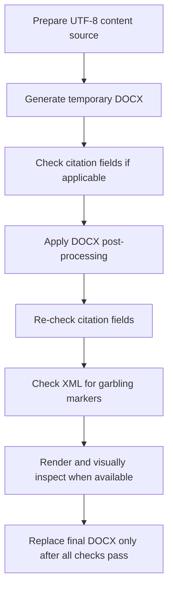

# chinese-word-pro

`chinese-word-pro` is a reusable Codex skill for creating, repairing, formatting, and validating Chinese Word `.docx` files and for finalizing bilingual academic submission Word deliverables.

It is built for academic and formal Chinese documents where typography, encoding, tables, figures, and formula rendering matter, especially when the final deliverable must be safe for submission rather than just visually acceptable at first glance.

## What This Skill Does

This skill is the Word-structure and typography specialist.

It helps the user:

- produce Chinese Word files from UTF-8 content sources
- enforce Chinese and Latin font separation correctly
- normalize table layout and three-line tables
- repair formula and subscript display problems
- reduce figure clipping and layout breakage
- inspect XML for garbling
- protect citation fields during DOCX post-processing
- finalize paired Chinese and English submission-ready Word files with the same structural rules

## Best Use Cases

Use this skill when the task involves:

- Chinese thesis or dissertation output
- Chinese journal article Word formatting
- table-heavy academic Word files
- mixed Chinese and English body text
- formula, Greek-letter, or subscript corruption in Word
- final manuscript delivery that must preserve citation fields

## Design Position

This skill is not the manuscript controller.

It should usually be used as the downstream Word-finishing layer after content has already been prepared elsewhere.

In a paper workflow:

- `management-empirical-writer` controls manuscript logic and delivery gates
- `chinese-word-pro` controls Word finalization, typography, and damage prevention

## Core Non-negotiables

- Chinese content must begin from UTF-8 source files.
- `run.font.name` alone is not sufficient; East Asian fonts must be set explicitly.
- Final DOCX delivery must be checked for garbling in OOXML.
- Temporary exports must not directly overwrite the user-facing final DOCX.
- If citation fields are part of the workflow, post-processing must not flatten or remove them.

## Default Formatting Intent

Unless the user specifies otherwise, this skill aims for:

- Chinese body: `宋体`
- English body: `Times New Roman`
- stable heading hierarchy
- left-aligned academic paragraphs by default
- academic table geometry
- three-line tables where appropriate
- safer inline formula display

It is especially suited to Chinese academic writing where Word output must look disciplined rather than flashy.

## Recommended Workflow

1. Edit the UTF-8 content source first.
2. Generate a temporary DOCX with the project-approved export chain.
3. If the document uses citation fields, verify they are present before post-processing.
4. Run DOCX post-processing for tables, figures, paragraphs, and formulas.
5. Re-check citation fields after post-processing.
6. Check `word/document.xml` for garbling markers.
7. Render to images when rendering is available.
8. Only then replace the final user-facing `.docx`.

## Academic Submission Finalization

This skill now includes a formal "Academic Submission Finalization" role for empirical paper delivery.

That role covers:

- bilingual `.docx` finalization
- journal-style table normalization
- figure-caption normalization
- native Word formula repair
- chapter pagination
- citation-safe post-processing

Typical finalization responsibilities:

- convert core equations into native Word math objects
- repair inline pseudo-formulas such as `Y_it`, `CR_it`, or `z(...)`
- force figures to remain inline rather than floating
- separate figure captions from interpretation paragraphs
- preserve caption numbering
- force body text, headings, captions, references, and table-cell text to left alignment unless explicitly overridden
- enforce chapter-open page breaks
- verify that citation fields survive post-processing

## Formal Delivery Flow



## Mandatory Delivery Audit

A final submission DOCX should not be considered passed unless all of the following are true:

- live citation fields are still present
- no garbling markers appear in OOXML
- body text, headings, captions, references, and table-cell paragraphs are left-aligned unless the user explicitly requested otherwise
- figure paragraphs are inline and captions remain independent paragraphs
- core formulas remain native Word objects where required
- tables preserve academic three-line structure
- abstract, major chapters, and references start on new pages where the workflow requires
- temporary exports are cleaned up after delivery

## Citation-Field Protection

This repository now explicitly treats citation-field protection as a delivery requirement.

For citation-managed manuscripts:

- post-processing must preserve Word citation fields
- a visually correct file is still a failed deliverable if citation fields disappeared
- the final check should inspect `word/document.xml`

Typical markers include:

- `ADDIN ZOTERO_ITEM`
- `CSL_CITATION`

## Zotero Preflight and Recovery

For Zotero-based manuscripts, run the Zotero preflight helper before citation-aware Word export:

```bash
python3 "$HOME/.codex/skills/chinese-word-pro/scripts/zotero_preflight_recover.py" \
  --collection-key "<ZOTERO_COLLECTION_KEY>" \
  --timeout 90 \
  --strict
```

The helper locates Zotero, opens it if needed, waits for the local connector, and tries to open the target collection through Zotero's `zotero://select` URI scheme.

If the scripted path cannot make the collection usable, the workflow may use Computer Use for one GUI recovery attempt to focus Zotero and select the intended collection. If the connector, collection, Better BibTeX, or MCP route still fails, stop and report the error. Do not produce a formal Word file with flattened citations.

When new references were added after the last healthy Word export, require a small live-citation smoke test before full delivery. The helper can audit that smoke DOCX:

```bash
python3 "$HOME/.codex/skills/chinese-word-pro/scripts/zotero_preflight_recover.py" \
  --collection-key "<ZOTERO_COLLECTION_KEY>" \
  --smoke-docx "<SMOKE_TEST_DOCX>" \
  --timeout 90
```

## Garbling and Formula Safety

This skill is designed to catch failures such as:

- replacement characters like `�`
- suspicious runs like `????`
- degraded inline math such as missing Greek letters
- broken subscript forms such as `(_i)` in place of true subscript

When needed, it prefers explicit Word runs and subscript formatting over trusting automatic conversion blindly.

For submission finalization, it also prefers native Word equation objects over plain-text pseudo-formulas whenever the manuscript presents formal empirical models.

## Common Failure Modes This Skill Is Meant to Prevent

- Chinese text damaged before DOCX generation
- mixed Chinese and English fonts rendering inconsistently
- tables with wrong indentation or broken three-line rules
- clipped figures or unsafe side-by-side layouts
- formula text that looks acceptable in Markdown but degrades in Word
- post-processing that accidentally destroys citation fields

## Repository Contents

- `SKILL.md`: main operating rules
- `references/`: Chinese Word and thesis-format references
- `scripts/`: build and post-process helpers, including submission finalization
- `assets/`: templates and sample inputs

## Relationship to Final Manuscript Delivery

This skill improves Word quality, but it should not by itself decide whether a paper is ready for formal submission delivery.

That final decision belongs to the manuscript workflow controller. In the recommended setup:

- `management-empirical-writer` determines whether formal delivery may proceed
- `chinese-word-pro` makes sure the Word file is structurally safe enough to deliver

## Companion Scripts

- `scripts/build_chinese_word.py`: UTF-8 source to initial Chinese Word generation
- `scripts/postprocess_thesis_docx.py`: legacy thesis-oriented DOCX cleanup
- `scripts/finalize_submission_docx.py`: bilingual journal-submission finalization for formulas, figures, tables, pagination, and citation-safe DOCX delivery
- `scripts/zotero_preflight_recover.py`: Zotero launch, collection selection, connector preflight, and optional live-citation smoke DOCX audit
