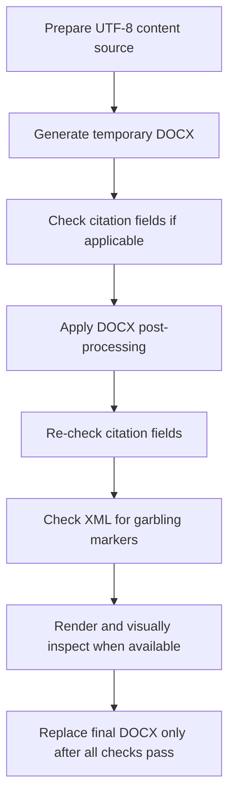

# chinese-word-pro

`chinese-word-pro` is a reusable Codex skill for creating, repairing, formatting, and validating Chinese Word `.docx` files and for finalizing bilingual academic submission Word deliverables.

It is built for academic and formal Chinese documents where typography, encoding, tables, figures, and formula rendering matter, especially when the final deliverable must be safe for submission rather than just visually acceptable at first glance.

## What This Skill Does

This skill is the Word-structure and typography specialist.

It helps the user:

- produce Chinese Word files from UTF-8 content sources
- enforce Chinese and Latin font separation correctly
- normalize table layout and three-line tables
- repair formula and subscript display problems
- reduce figure clipping and layout breakage
- inspect XML for garbling
- protect citation fields during DOCX post-processing
- finalize paired Chinese and English submission-ready Word files with the same structural rules

## Best Use Cases

Use this skill when the task involves:

- Chinese thesis or dissertation output
- Chinese journal article Word formatting
- table-heavy academic Word files
- mixed Chinese and English body text
- formula, Greek-letter, or subscript corruption in Word
- final manuscript delivery that must preserve citation fields

## Design Position

This skill is not the manuscript controller.

It should usually be used as the downstream Word-finishing layer after content has already been prepared elsewhere.

In a paper workflow:

- `management-empirical-writer` controls manuscript logic and delivery gates
- `chinese-word-pro` controls Word finalization, typography, and damage prevention

## Core Non-negotiables

- Chinese content must begin from UTF-8 source files.
- `run.font.name` alone is not sufficient; East Asian fonts must be set explicitly.
- Final DOCX delivery must be checked for garbling in OOXML.
- Temporary exports must not directly overwrite the user-facing final DOCX.
- If citation fields are part of the workflow, post-processing must not flatten or remove them.

## Default Formatting Intent

Unless the user specifies otherwise, this skill aims for:

- Chinese body: `宋体`
- English body: `Times New Roman`
- stable heading hierarchy
- left-aligned academic paragraphs by default
- academic table geometry
- three-line tables where appropriate
- safer inline formula display

It is especially suited to Chinese academic writing where Word output must look disciplined rather than flashy.

## Recommended Workflow

1. Edit the UTF-8 content source first.
2. Generate a temporary DOCX with the project-approved export chain.
3. If the document uses citation fields, verify they are present before post-processing.
4. Run DOCX post-processing for tables, figures, paragraphs, and formulas.
5. Re-check citation fields after post-processing.
6. Check `word/document.xml` for garbling markers.
7. Render to images when rendering is available.
8. Only then replace the final user-facing `.docx`.

## Formal Delivery vs Recovery Drafts

This skill distinguishes formal submission output from recovery or working-draft layout output.

Formal submission output:

- uses the citation-aware export chain first
- runs `finalize_submission_docx.py` with `--citation-policy strict`
- fails if live citation fields are absent in citation-managed manuscripts
- may replace user-facing final `.docx` files only after all citation, formula, table, figure, garbling, and render checks pass

Recovery or working-draft layout output:

- is allowed only when a readable Word file is needed before citation-aware export has been repaired
- runs `finalize_submission_docx.py` with `--citation-policy warn`
- may repair formulas, tables, captions, figures, pagination, and typography
- must be reported as a recovery draft or working draft
- must not be represented as a formal submission file when live citation fields are absent

Non-citation-managed output:

- may use `--citation-policy off`
- should not be used for empirical manuscripts with citekeys unless the user explicitly abandons live-citation delivery

## Academic Submission Finalization

This skill now includes a formal "Academic Submission Finalization" role for empirical paper delivery.

That role covers:

- bilingual `.docx` finalization
- journal-style table normalization
- figure-caption normalization
- native Word formula repair
- chapter pagination
- citation-safe post-processing

Typical finalization responsibilities:

- convert core equations into native Word math objects
- repair inline pseudo-formulas such as `Y_it`, `CR_it`, or `z(...)`
- keep numbered formulas on the same visual line as their equation numbers
- force figures to remain inline rather than floating
- separate figure captions from interpretation paragraphs
- preserve caption numbering
- center figure captions and table captions as independent paragraphs
- force body text, headings, captions, references, and table-cell text to left alignment unless explicitly overridden
- enforce chapter-open page breaks
- verify that citation fields survive post-processing

## Formula Finalization Pipeline

This skill now treats formulas as a dedicated delivery pipeline rather than as a loose set of cosmetic repairs.

The required pipeline is:

1. detect formula-bearing content
2. build a formula inventory
3. classify each item as display equation, inline symbol, or plain text
4. repair inline symbols through the inline symbol renderer
5. convert display equations through the OMML equation compiler
6. run formula delivery audit before overwrite

This is important because formula failures are not limited to one place. They can appear in:

- numbered empirical models
- measurement formulas
- PageRank or network formulas
- standardization formulas
- inline explanations of symbols immediately below formulas

Without a dedicated pipeline, the workflow becomes reactive and project-specific. With the pipeline, formula handling becomes a reusable finalization discipline.

The underlying lesson is general:

- formula failures are rarely caused by one bad token alone
- they usually come from a missing delivery chain that does not jointly handle display equations, explanatory prose, numbering layout, and final audit

This skill therefore treats formula robustness as a workflow property, not as a one-off patch.

### Default General Solution

The default cross-project solution is now explicit:

- native Word OMML equations for display formulas
- right-aligned tab-stop numbering on the same numbered paragraph
- automatic internal wrapping for overlong equations
- Word-native subscript or superscript runs for explanation prose
- fail-closed audit if orphan numbering, pseudo-formula residue, or collapsed subscripts survive

This is meant to prevent repeated regressions when a new manuscript introduces different variables, longer regression models, or additional measurement formulas.

## Formula Inventory

For formal delivery, the skill should treat formulas as an audited inventory rather than as accidental strings that happen to appear in the manuscript.

The inventory should cover:

- numbered empirical models
- measurement formulas
- weighting or network formulas
- multiline equations
- inline symbolic explanations
- repeated coefficient or Greek-letter forms

Even if a project does not maintain a separate formula manifest, the finalizer should behave as though an implicit inventory exists and audit all detectable formula-bearing content before delivery.

## Inline Symbol Renderer

Not all formula problems belong to display equations. Many appear in the prose that explains them.

The inline symbol renderer is responsible for turning source-like notation into readable Word-native runs, including patterns such as:

- `Return_{im}`
- `AIDisclosure_{it}`
- `AIPatent_{it}`
- `PR_{kt}`
- `K_{it}`
- `N_{ikt}`
- `w_1`, `w_2`
- `α_1`, `β_k`, `μ_i`, `λ_t`
- squared terms like `AIW²`

Its job is to prevent formal delivery from exposing raw `_`, `{}`, `\\sigma`, `\\overline`, or similar markup-like residue in ordinary explanatory paragraphs.

It also must catch collapsed residues that often survive ordinary find-and-replace logic, for example:

- `Resilienceit`
- `AIWit`
- `Outcomeit`
- `Controlsit`
- `w1`, `w2`
- `μi`, `λt`, `εit`

If these appear in explanation prose without true subscript runs, delivery should fail rather than silently passing.

## OMML Equation Compiler

The OMML equation compiler is responsible for display equations.

Its goals are to:

- convert formula text into native Word math objects
- preserve multiline equations as one equation block
- keep equation numbers on the same visual row as the equation
- choose a stable numbering layout

Default strategy:

- short single-line equations should use native equation objects plus a right-aligned tab stop and same-line numbering by default
- long or multiline equations should remain one numbered equation paragraph and wrap internally when possible, so the equation stays complete and the number remains aligned on the last visual line
- if a previous DOCX contains an equation paragraph plus a separate orphan number paragraph, the compiler should rebuild them into one native numbered equation paragraph and delete the orphan

The key point is that layout choice is an implementation strategy inside the compiler, not the governing policy itself.

## Formula Delivery Audit

Formal delivery must include a dedicated formula audit.

The audit must confirm:

- display equations that should be native math actually contain `m:oMath` or `m:eqArr`
- equation numbers are present, ordered, and stay on the same row as the equation
- orphan number-only paragraphs do not remain after finalization
- long equations are not left as one page-overflowing unbroken row
- multiline equations are not fragmented into unrelated pieces
- explanatory prose does not expose raw source-like strings such as `Stability_{it}`, `CR_{it}`, `\\overline{...}`, or `\\sigma(...)`
- inline variables use true subscript or superscript formatting where required
- collapsed residues such as `Resilienceit`, `Outcomeit`, `w1`, `w2`, `μi`, and `λt` are not delivered as ordinary plain text
- equation containers do not inherit ordinary table borders or clipping-prone line-height settings

Fail-closed rule:

- if raw formula residue survives in a formal delivery DOCX, the file fails formula audit and must not replace the main manuscript deliverable

## Formal Delivery Flow



## Mandatory Delivery Audit

A final submission DOCX should not be considered passed unless all of the following are true:

- live citation fields are still present
- no garbling markers appear in OOXML
- body text, headings, captions, references, and table-cell paragraphs are left-aligned unless the user explicitly requested otherwise
- figure paragraphs are inline and captions remain independent paragraphs
- figure captions and table captions are centered independently from body text
- core formulas remain native Word objects where required
- equation numbers are right-aligned on the same row as their equations
- equation layout tables are borderless and not treated as ordinary three-line tables
- tables preserve academic three-line structure
- abstract, major chapters, and references start on new pages where the workflow requires
- temporary exports are cleaned up after delivery

For recovery drafts, run the same structural audit but record missing citation fields as a formal-delivery blocker rather than silently accepting the file.

## Citation-Field Protection

This repository now explicitly treats citation-field protection as a delivery requirement.

For citation-managed manuscripts:

- post-processing must preserve Word citation fields
- a visually correct file is still a failed deliverable if citation fields disappeared
- the final check should inspect `word/document.xml`

Typical markers include:

- `ADDIN ZOTERO_ITEM`
- `CSL_CITATION`

## Zotero Preflight and Recovery

For Zotero-based manuscripts, run the Zotero preflight helper before citation-aware Word export:

```bash
python3 "$HOME/.codex/skills/chinese-word-pro/scripts/zotero_preflight_recover.py" \
  --collection-key "<ZOTERO_COLLECTION_KEY>" \
  --timeout 90 \
  --strict
```

The helper locates Zotero, opens it if needed, waits for the local connector, and tries to open the target collection through Zotero's `zotero://select` URI scheme.

If the scripted path cannot make the collection usable, the workflow may use Computer Use for one GUI recovery attempt to focus Zotero and select the intended collection. If the connector, collection, Better BibTeX, or MCP route still fails, stop and report the error. Do not produce a formal Word file with flattened citations.

When new references were added after the last healthy Word export, require a small live-citation smoke test before full delivery. The helper can audit that smoke DOCX:

```bash
python3 "$HOME/.codex/skills/chinese-word-pro/scripts/zotero_preflight_recover.py" \
  --collection-key "<ZOTERO_COLLECTION_KEY>" \
  --smoke-docx "<SMOKE_TEST_DOCX>" \
  --timeout 90
```

## Garbling and Formula Safety

This skill is designed to catch failures such as:

- replacement characters like `�`
- suspicious runs like `????`
- degraded inline math such as missing Greek letters
- broken subscript forms such as `(_i)` in place of true subscript

When needed, it prefers explicit Word runs and subscript formatting over trusting automatic conversion blindly.

For submission finalization, it also prefers native Word equation objects over plain-text pseudo-formulas whenever the manuscript presents formal empirical models.

The finalizer should recognize both plain pseudo-formulas and Pandoc/LaTeX-style formula strings, including `AIPatent_{it}`, `AIW_{it}`, `Resilience_{it}`, `Channel_{it}`, `Outcome_{it}`, `PR_{kt}`, and `z(...)`. These forms should not survive in Word as source-code-like text when they are display equations or symbol explanations.

## Equation Layout Finalization

Numbered display equations require a stricter Word layout than ordinary paragraphs.

Default layout:

- Use a native Word equation object plus a right-aligned tab stop and same-line equation number as the primary strategy.
- Keep multiline formulas as one native math block, not separate formula paragraphs.
- Keep formula numbering on the same visual row as the equation block.
- Use a borderless equation-layout fallback container only when the default tab-stop strategy is visually unstable for a long or multiline formula.

Required protection:

- Do not let fallback equation containers receive ordinary three-line table borders.
- Remove all visible borders from fallback equation containers.
- Remove fixed line spacing and fixed row heights inside fallback equation containers.
- Add enough before/after spacing so multiline equations do not look cramped.
- Check the rendered pages containing the longest formulas; XML structure alone cannot prove that no clipping occurred.

Failure examples:

- equation number appears below the equation
- equation number appears on the left or in an inconsistent position
- fallback-container rules cross through formulas
- multiline formula is clipped because of fixed line height
- formula is correct in XML but visually cramped or cut off in PDF/Word rendering

Command examples:

```bash
# Formal delivery: fail if citation fields are absent.
python3 "$HOME/.codex/skills/chinese-word-pro/scripts/finalize_submission_docx.py" \
  --input-docx temp_export.docx \
  --output-docx final.docx \
  --lang cn \
  --mode journal_submission \
  --citation-policy strict

# Recovery or working draft: repair layout, but warn if citation fields are absent.
python3 "$HOME/.codex/skills/chinese-word-pro/scripts/finalize_submission_docx.py" \
  --input-docx temp_export.docx \
  --output-docx recovery_layout.docx \
  --lang cn \
  --mode journal_submission \
  --citation-policy warn
```

## Caption And Chinese Text Cleanup

Formal Chinese or bilingual Word delivery should also clean small typographic issues that are easy to miss.

Caption rules:

- Figure captions and table captions should be independent centered paragraphs.
- Narrative paragraphs such as `表 1 报告了...` are not captions and should not be centered.
- Chinese caption numbering should remain readable, such as `图 2a 标题`.
- English captions should follow the project pattern, such as `Figure 1. Title` and `Table 1. Title`.

Chinese visible-text cleanup:

- Remove unnecessary spaces before Chinese punctuation.
- Remove unnecessary spaces between Chinese characters.
- Remove unnecessary spaces between numbers and Chinese measurement words, such as `1%水平`, `4位`, and `2010至2024年`, unless the journal style requires otherwise.
- Convert visible English punctuation next to Chinese text to Chinese punctuation where safe.

Safety rule:

- Do not edit Zotero field metadata, field instructions, equations, drawings, or other hidden OOXML content merely because it contains English spaces or punctuation.
- Always re-audit citation fields after cleanup.

## Common Failure Modes This Skill Is Meant to Prevent

- Chinese text damaged before DOCX generation
- mixed Chinese and English fonts rendering inconsistently
- tables with wrong indentation or broken three-line rules
- clipped figures or unsafe side-by-side layouts
- centered captions drifting back to body alignment or body paragraphs being mistaken for captions
- formula text that looks acceptable in Markdown but degrades in Word
- formula numbers that drift into standalone paragraphs or formula tables that inherit three-line table borders
- post-processing that accidentally destroys citation fields

## Repository Contents

- `SKILL.md`: main operating rules
- `references/`: Chinese Word and thesis-format references
- `scripts/`: build and post-process helpers, including submission finalization
- `assets/`: templates and sample inputs

## Relationship to Final Manuscript Delivery

This skill improves Word quality, but it should not by itself decide whether a paper is ready for formal submission delivery.

That final decision belongs to the manuscript workflow controller. In the recommended setup:

- `management-empirical-writer` determines whether formal delivery may proceed
- `chinese-word-pro` makes sure the Word file is structurally safe enough to deliver

## Companion Scripts

- `scripts/build_chinese_word.py`: UTF-8 source to initial Chinese Word generation
- `scripts/postprocess_thesis_docx.py`: legacy thesis-oriented DOCX cleanup
- `scripts/finalize_submission_docx.py`: bilingual journal-submission finalization for formulas, figures, tables, pagination, and citation-safe DOCX delivery
- `scripts/zotero_preflight_recover.py`: Zotero launch, collection selection, connector preflight, and optional live-citation smoke DOCX audit
